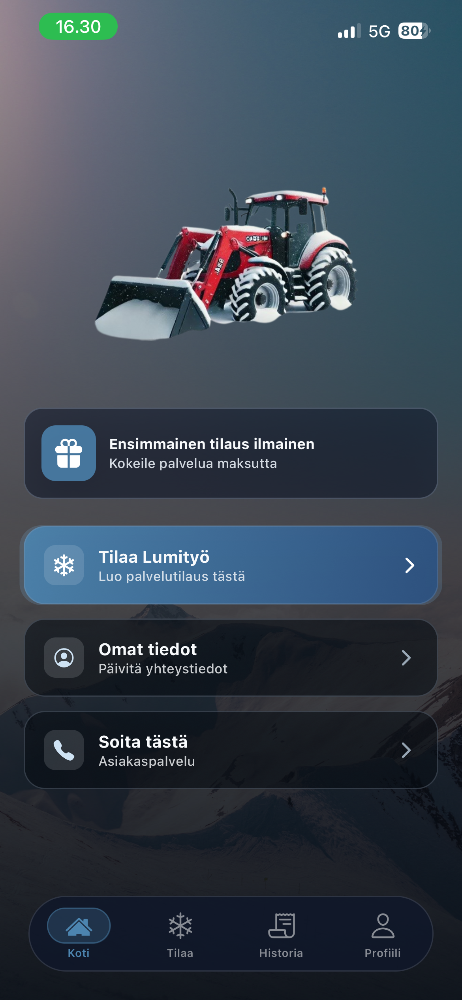
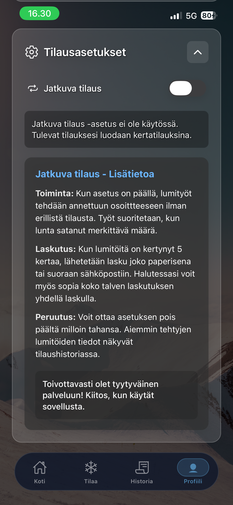

<div align="center">

<!-- Replace with your actual header image -->


<br/>

**Snow clearing, on-demand. Built for Finnish winters.**


</div>


---

## What is this?

**Lumityö-tilaus** is a mobile app for ordering professional snow clearing services in Finland. Customers can place one-time or recurring orders for snow removal and ice clearing — directly from their phone, with real-time address lookup and an interactive map to pin the exact location.

---

## Screenshots

| | | |
|:---:|:---:|:---:|
|  |  |  |

---

## Features

- **❄️ Snow clearing order** — one-tap order for your address
- **🧊 Ice removal** — Polanteen poisto service
- **🔁 Jatkuva tilaus** — recurring automatic service, activated once, runs every snowfall
- **🗺️ Interactive map** — drag-and-drop pin to confirm exact service location
- **🔔 Free first order** — new users get their first order free
- **📋 Order history** — track past orders and their statuses synced from Supabase
- **📧 Contact form** — send messages directly via EmailJS
- **📱 Cross-platform** — iOS and Android via Expo

---

## Tech Stack

| Layer | Tech |
|-------|------|
| Framework | React Native + Expo SDK 54 |
| Backend | Supabase (Postgres + REST API) |
| Maps | Mapbox (via WebView) |
| Address Autocomplete | Mapbox Geocoding + OpenCage |
| Email | EmailJS |
| Navigation | React Navigation (Bottom Tabs) |
| Storage | AsyncStorage + Supabase |

---

## Getting Started

### Prerequisites

- Node.js 18+
- Expo CLI (`npm install -g expo-cli`)
- An [EAS account](https://expo.dev) for builds

### Install

```bash
git clone https://github.com/thahertech/Lumityo-tilaus.git
cd Lumityö-tilaus-app
npm install
```

### Environment variables

Create a `.env` file in the root of `Lumityö-tilaus-app/`:

```env
EXPO_PUBLIC_SUPABASE_URL=your_supabase_project_url
EXPO_PUBLIC_SUPABASE_ANON_KEY=your_supabase_anon_key
EXPO_PUBLIC_EMAILJS_SERVICE_ID=your_emailjs_service_id
EXPO_PUBLIC_EMAILJS_TEMPLATE_ID=your_emailjs_template_id
EXPO_PUBLIC_EMAILJS_USER_ID=your_emailjs_user_id
EXPO_PUBLIC_MAPBOX_ACCESS_TOKEN=your_mapbox_token
EXPO_PUBLIC_OPENCAGE_API_KEY=your_opencage_key
```

> ⚠️ Never commit `.env` — it is gitignored.

### Run

```bash
npx expo start
```

Press `i` for iOS simulator, `a` for Android emulator, or scan the QR with Expo Go.

---

## Project Structure

```
Lumityö-tilaus-app/
├── screens/
│   ├── HomeScreen.js          # Landing + animated CTA
│   ├── OrderScreen.js         # Order creation form + map preview
│   ├── OmatTiedotScreen.js    # User profile + jatkuva tilaus + history
│   └── ExtraScreen.js         # Info & extras
├── components/
│   ├── OrderMapPreview.js     # Interactive Mapbox pin (WebView)
│   └── AddressAutocompleteMapboxNew.js
├── Navigation/
│   └── AppNavigator.js        # Floating transparent tab dock
├── utils/
│   └── OrderHistoryUtils.js   # History sync with Supabase
├── SupabaseAPI.js             # All Supabase queries
├── FreeOrderUtils.js          # Free order eligibility logic
├── app.config.js              # Expo config + env passthrough
└── .env                       # 🔒 Secret credentials (gitignored)
```

---

## Services

| Service | Price estimate |
|---------|---------------|
| Lumityö (snow clearing) | 10–20 € |
| Polanteen poisto (ice removal) | 20–30 € |

---

## Security

- All API keys and credentials are stored in `.env` — never in source code
- `.env` is gitignored
- Supabase anon key is scoped with row-level security (RLS)

---

## License

Private project — all rights reserved.
